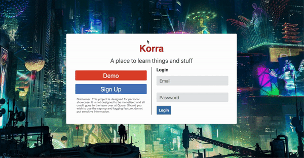

# Korra

## Demo
Link: https://korra-fsp.herokuapp.com/

## Overview

[Korra](https://korra-fsp.herokuapp.com/) is project is a full-stack project developed at my time at App Academy. This site is a site copy of [Quora](https://www.quora.com/) that is made from the following technologies:

• React.js 

• SASS

• PostgreSQL 

• Ruby on Rails

## Technical Overview and Features

The app utilizes Ruby on Rails as a back-end where PostgreSQL is used to store data for the app. Using the JavaScript AJAX library, React is able to fetch the data and render it on the front-end.

Through this, users are able to post questions, answers, and comments that will appear in real time. 

In addition, the original Quora site is not responsive both for mobile and larger screens. My attempt to make this site responsive for larger screens was to practice learning responsive design as well as prepare for possible future presentations of varying screen size. In the future, I may consider doing it for mobile that allows users to access the site from their phones.

## Inspirations, Lessons Learned and Future Plans

Much of this site was created with the intention of making it function and look as similarly to the actual Quora website as much as possible. 

The name itself, Korra (inspired by [Avatar: The Legend of Korra](https://www.nick.com/shows/legend-of-korra)), sounds exactly like how Quora is pronounced. 

I definitely learned a lot from this site. From the ground up, I was able to get some understanding of how Quora may have been made. Using a back-end database and fetching data to the front-end, I've garnered a better understanding of full-stack development.

While I take a lot of pride in this project, there are still features that I may want to implement in the future. 
For example, the original Quora site allows users to upvote comments and answers as well as post images.

These were tasks that I deemed unncessary in the original timespan of the project because I wanted to get the main functionalities of allowing users to interact with the site by asking questions, answering them and comment on them. In addition, I had an idea of implementing a dark mode feature but I figured that that feature was for another time.